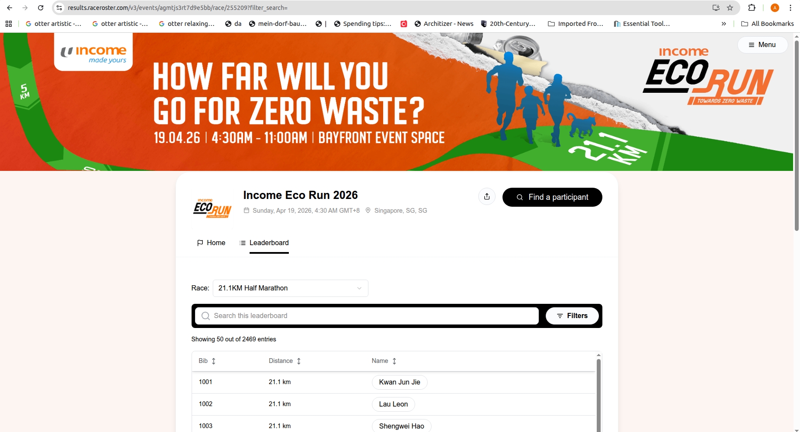
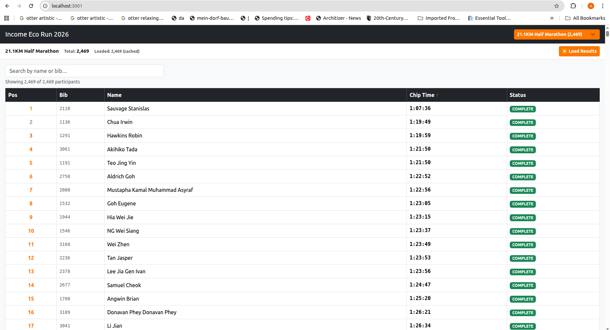

# Income Eco Run 2026 – Results Viewer

Built by **axlee** because the official results page was incredibly shitty and had redundant information on it.

The [official site](https://results.raceroster.com/v3/events/agmtjs3rt7d9e5bb/race/255209) only shows your name, distance, and bib number — no placement, no chip time, nothing useful. So I built my own viewer with one goal: **find out where I actually placed.**

## Original website vs. mine

| | |
|---|---|
| Original |  |
| Mine |  |

## Tech stack

No npm packages, no build step — just the platform plus Bootstrap for styling.

| Layer | What's used |
|---|---|
| **Runtime** | Node.js (stdlib only — `http`, `https`, `fs`, `path`) |
| **Frontend** | Vanilla HTML + ES module JavaScript |
| **CSS** | [Bootstrap 5.3](https://getbootstrap.com/) (CDN) + small custom overrides for the brand accent colour |
| **API** | RaceRoster v2 REST API (`results.raceroster.com`) |
| **Proxy** | Local Node server forwards `/api/*` to RaceRoster to avoid CORS |
| **Caching** | Browser `localStorage` (1-hour TTL) |
| **Deployment** | Docker (single-stage Alpine image) |

## Features

- Race category dropdown loaded from the live event API
- Discovers every participant via ~162 parallel prefix searches (a–z, 10–145)
- Fetches chip times 20 at a time and renders the table as data arrives
- Search by name or bib number
- Sort by position, bib, name, or chip time
- Gold/silver/bronze highlights for the top 3
- 1-hour `localStorage` cache — reopening the same race is instant
- Falls back to a baked-in static race list if the API is unreachable

## Project structure

```
├── backend/
│   └── server.js              # Static file server + HTTPS proxy to results.raceroster.com
└── frontend/
    ├── index.html
    ├── css/styles.css
    └── js/
        ├── app.js             # Bootstrap, event wiring, load orchestration
        ├── api.js             # Fetch wrappers for RaceRoster v2 API
        ├── loader.js          # Participant discovery, timing fetch, localStorage cache
        ├── render.js          # Table rendering, sorting/filtering, progress bar
        ├── state.js           # Shared mutable state (event code, selection, participants)
        └── races/
            ├── index.js       # Loader — imports and re-exports all races as an array
            ├── 21_1_km.js     # 21.1KM Half Marathon (id 255209)
            ├── 15_km.js       # 15KM              (id 255210)
            ├── 10_km.js       # 10KM              (id 255211)
            ├── 5_km.js        # 5KM               (id 255212)
            ├── 3_km.js        # 3KM               (id 255213)
            ├── 1_2_km_kids.js # 1.2km - Kids      (id 255214)
            ├── 700m_kids.js   # 700m - Kids        (id 255215)
            ├── 1_2_km_pets.js # 1.2KM - Pets      (id 255216)
            └── 700m_pets.js   # 700m - Pets        (id 255217)
```

## Races

| File | Race | Sub-event ID | Participants |
|---|---|---|---|
| `21_1_km.js` | 21.1KM Half Marathon | 255209 | 2,469 |
| `15_km.js` | 15KM | 255210 | 498 |
| `10_km.js` | 10KM | 255211 | 1,706 |
| `5_km.js` | 5KM | 255212 | 964 |
| `3_km.js` | 3KM | 255213 | 246 |
| `1_2_km_kids.js` | 1.2km - Kids | 255214 | 123 |
| `700m_kids.js` | 700m - Kids | 255215 | 293 |
| `1_2_km_pets.js` | 1.2KM - Pets | 255216 | 254 |
| `700m_pets.js` | 700m - Pets | 255217 | 68 |

Each file exports `{ id, name, resultCount }`. `races/index.js` pulls them all into a single array that `app.js` uses as a fallback when the API is unreachable.

## Running locally

Need Node.js — that's it, no `npm install`.

```bash
node backend/server.js
```

Open [http://localhost:3001](http://localhost:3001).

## Running with Docker

```bash
sudo docker build -t income-eco-run .
sudo docker run -p 3001:3001 income-eco-run
```

Open [http://localhost:3001](http://localhost:3001).

### Troubleshooting port conflicts

If this error is encountered:"address already in use" or "port is already allocated" error, to free up port 3001 and clear out lingering Docker containers, run these commands.

**1. Find what is using port 3001 and kill its PID:**
```bash
sudo lsof -i :3001
sudo kill -9 <PID>
```

**2. Stop and remove old Docker containers:**
```bash
sudo docker ps -a -q | xargs -r sudo docker rm -f
```


## How it works

1. On load, the app hits the RaceRoster API with the event code (`agmtjs3rt7d9e5bb`) to get the race list. If that fails, it falls back to the static configs in `races/`.
2. Clicking **▶ Load Results** fires off ~162 search queries in parallel to discover every participant ID in the selected category.
3. It then fetches individual timing records (20 at a time) and streams results into the table as they arrive.
4. Everything gets cached in `localStorage` for an hour — next time you open the same race it loads instantly.
